## 📋 1. Entorno Inicial

El servidor utilizado para esta guía cuenta con las siguientes especificaciones:

| Componente | Versión o configuración |
| :--- | :--- |
| **SO** | Ubuntu Server 26.04.1 LTS |
| **Apache** | 2.4.66 |
| **PHP** | 8.5.4 |
| **MySQL** | 8.4.11 |
| **WordPress** | Instalación existente |
| **Directorio WordPress** | `/srv/www/wordpress` |
| **Base de datos WordPress** | `wordpress` |
| **Usuario MySQL WordPress** | `wordpress` |

> **Nota:** Apache y MySQL se encuentran activos y operativos antes de comenzar. La instalación de Dolibarr se realizará de forma independiente, **sin modificar ni sustituir** la web de WordPress existente.

---

## 🛠️ 2. Requisitos y Comprobación

Según la documentación oficial de Dolibarr, la versión 24 es compatible con PHP 7.2 hasta PHP 8.5 y bases de datos MySQL 5.7.7 o superior, requiriendo al menos `128 MB` en el parámetro `memory_limit` de PHP.

| Programa / Dependencia | Requisitos Dolibarr | Estado en el Servidor |
| :--- | :--- | :--- |
| **SO** | Sistema compatible | Ubuntu Server 26.04.1 |
| **Servidor Web** | Apache / PHP | Apache 2.4.66 |
| **PHP** | 7.2 - 8.5 | 8.5.4 |
| **MySQL** | 5.7.7+ | 8.4.11 |
| **mysqli** | Requerido para MySQL | ✅ Instalado |
| **curl** | Extensión requerida | ✅ Instalado |
| **intl** | Extensión requerida | ✅ Instalado |
| **mbstring** | Extensión PHP | ✅ Instalado |
| **xml** | Extensión PHP | ✅ Instalado |
| **zip** | Extensión PHP | ✅ Instalado |
| **gd** | Extensión PHP | ✅ Instalado *(añadido para este proceso)* |

---

## ⚙️ 3. Pasos de Instalación

### Paso 1: Configuración de la Base de Datos
Accedemos a MySQL:
> *Para este manual usaremos `dolibarr` tanto de usuario como de contraseña. Asegúrate de usar credenciales seguras en tu entorno de producción.*

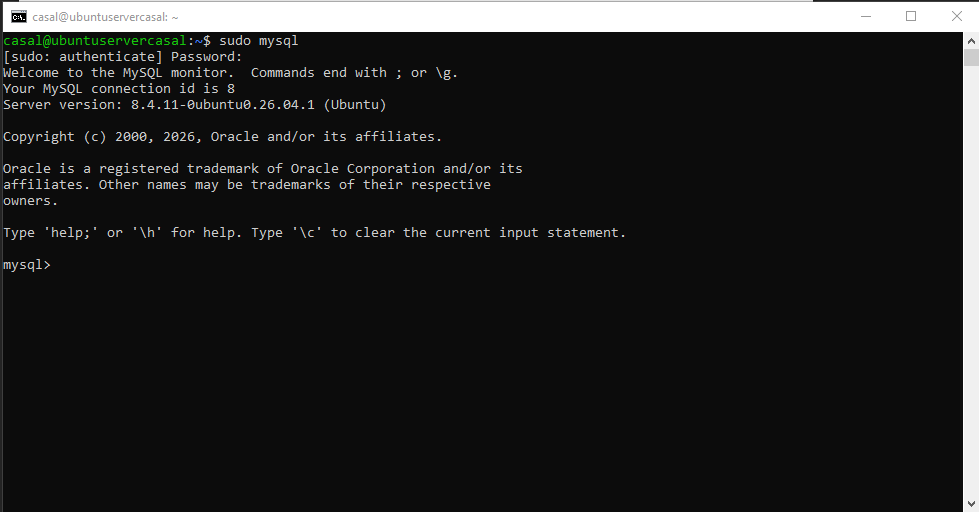

Creamos la base de datos, el usuario y le otorgamos los permisos necesarios:
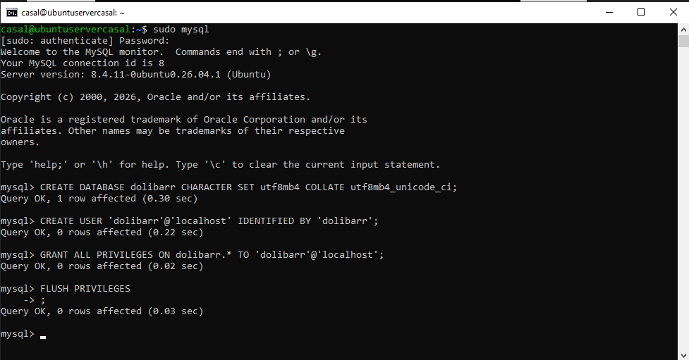

---

### Paso 2: Crear el directorio de Dolibarr
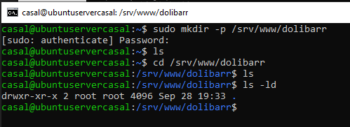

---

### Paso 3: Descargar Dolibarr en `/tmp`
Descargamos el paquete comprimido oficial:
```bash
wget https://www.dolibarr.org/files/stable/standard/dolibarr-24.0.1.zip
```
Comprobamos que el archivo se haya descargado correctamente:
```bash
ls -lh dolibarr-24.0.1.zip
```
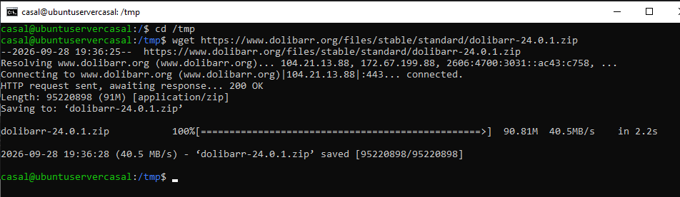
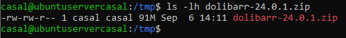

---

### Paso 4: Descomprimir y mover los archivos
Si no tienes la utilidad `unzip` instalada, instálala primero:
```bash
sudo apt install unzip
```
Descomprimimos el archivo en el directorio actual:
```bash
unzip dolibarr-24.0.1.zip
```
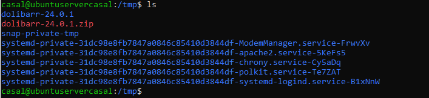

Movemos el contenido descomprimido al directorio del proyecto:
```bash
sudo cp -r /tmp/dolibarr-24.0.1/* /srv/www/dolibarr/
```


Verificamos que se haya copiado correctamente:
```bash
ls -la /srv/www/dolibarr/
```
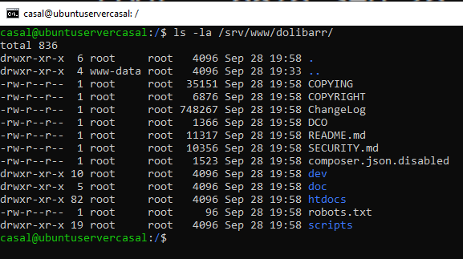

---

### Paso 5: Crear directorio de documentos de Dolibarr
```bash
sudo mkdir -p /srv/www/dolibarr/documents
```
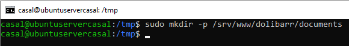

---

### Paso 6: Configurar Permisos
Identificamos el usuario bajo el cual corre Apache (habitualmente `www-data`):
```bash
ps aux | grep apache2
```
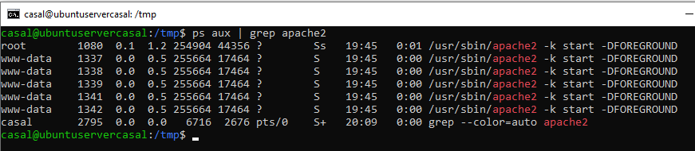

Asignamos la propiedad del directorio al usuario del servidor web:
```bash
sudo chown -R www-data:www-data /srv/www/dolibarr
```
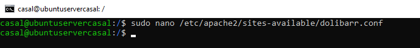

---

### Paso 7: Crear el VirtualHost de Dolibarr
Creamos y editamos el archivo de configuración del sitio web:
```bash
sudo nano /etc/apache2/sites-available/dolibarr.conf
```
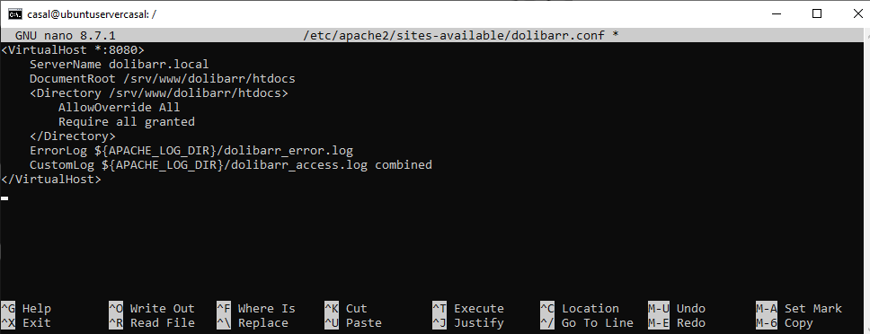

---

### Paso 8: Habilitar el VirtualHost y Módulos de Apache
Habilitamos el sitio y los módulos necesarios, comprobando la sintaxis y reiniciando el servicio:
```bash
sudo a2ensite dolibarr.conf
sudo a2enmod rewrite
sudo apache2ctl configtest
sudo systemctl restart apache2
```
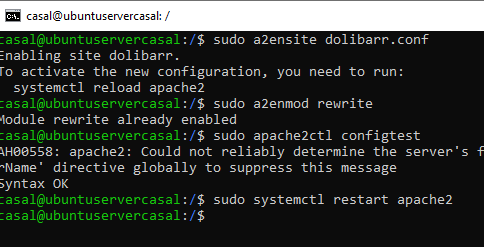

---

### Paso 9: Configuración de Puertos (Evitar conflictos con WordPress)
Para que WordPress y Dolibarr convivan en la misma máquina, haremos que WordPress corra en el puerto `80` y Dolibarr en el puerto `8080`.

Editamos el archivo de puertos de Apache:
```bash
sudo nano /etc/apache2/ports.conf
```
Y justo debajo de `Listen 80`, añadimos:
```text
Listen 8080
```
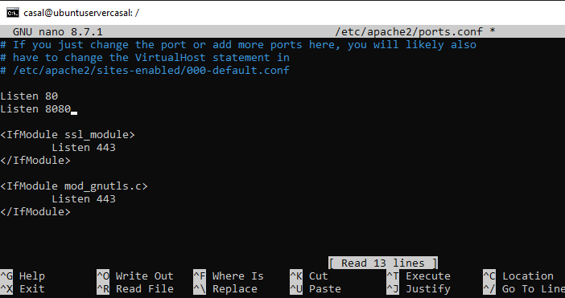

Verificamos que cada VirtualHost escuche en su puerto correspondiente:
* **WordPress:** `VirtualHost *:80`
* **Dolibarr:** `VirtualHost *:8080` *(definido en su archivo `.conf`)*

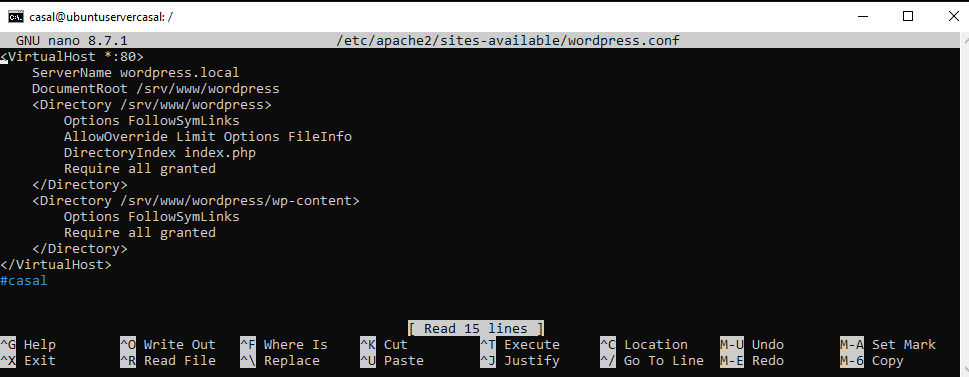

Reiniciamos Apache para aplicar los cambios de puertos:
```bash
sudo systemctl restart apache2
```

---

### Paso 10: Acceso Web
Comprobamos la IP de nuestro servidor ejecutando:
```bash
ip addr
```
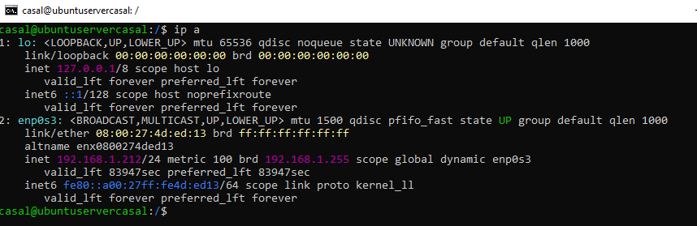

Accede a tus aplicaciones desde el navegador usando las siguientes URLs:

* 🌐 **WordPress:** `http://<tu_ip>:80` *(Ej: `http://10.0.9.109:80`)*
  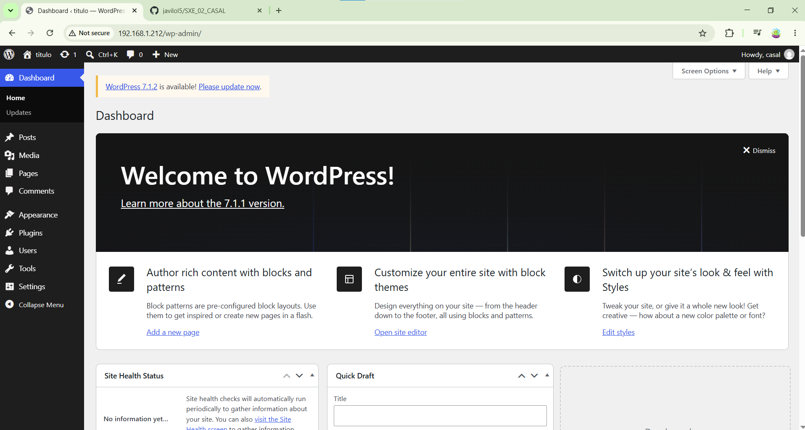

* 💼 **Dolibarr:** `http://<tu_ip>:8080` *(Ej: `http://10.0.9.109:8080`)*
  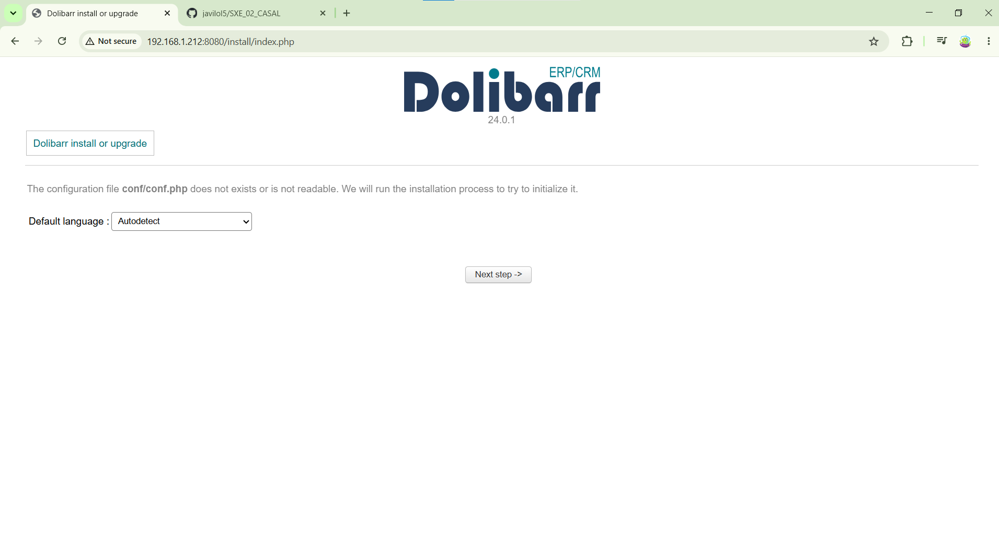


## 🔧 4. Resolución de Incidencias

### Incidencia: `unzip` no instalado
Si durante el proceso de instalación no es posible descomprimir el paquete de Dolibarr debido a que la utilidad no se encuentra presente en el sistema, será necesario instalarla ejecutando el siguiente comando:

```bash
sudo apt update && sudo apt install unzip
```

Una vez finalizada la instalación, el archivo comprimido podrá descomprimirse con normalidad.